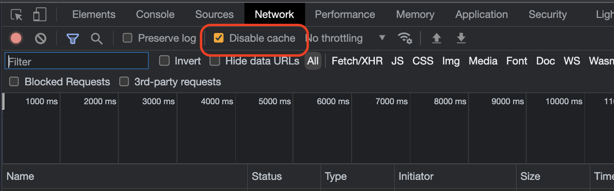

# Hugo Theme: Mild

Mild is a theme for hugo which is ported from [simpleness](https://github.com/RainerChiang/simpleness).

[](https://github.com/mildronize/hugo-theme-mild/actions/workflows/deploy-gh-pages.yaml)

## Lighthouse Pagespeed

[](https://htmlpreview.github.io/?https://raw.githubusercontent.com/mildronize/hugo-theme-mild/main/lighthouse_results/mobile/thadaw_com_hugo_theme_mild_.html)


## Live Demo

<https://thadaw.com/hugo-theme-mild/>

[](https://thadaw.com/hugo-theme-mild/)

## Features

- MathJax suport
- Google Analytics support
- Comment systems include: disqus, valine
- Table of content
- PostCSS
- TypeScript
- Theme Switch 
- Code Highlight using Prism JS based on theme

## TODO

- [ ] Pagination for posts

## Quick Start

### 1. Install Hugo

[Download](https://github.com/gohugoio/hugo/releases) the appropriate version for your platform. 

I used [hugo_extended_0.75.1_Linux-64bit.deb](https://github.com/gohugoio/hugo/releases/download/v0.75.1/hugo_extended_0.75.1_Linux-64bit.deb) to develop this theme.

### 2. Create a New Site

```shell
hugo new site myBlog
```

### 3. Use hugo theme mild

```shell
cd myBlog
git init
git submodule add https://github.com/mildronize/mild-theme.git themes/mild
```

copy the content of exampleSite

```shell
cp themes/mild/exampleSite/config.toml .
cp -r themes/mild/exampleSite/content .
```

build site

```shell
hugo server
```

then, open http://localhost:1313/ in your browser。

## Todo

- [ ] Write Hugo Shortcode for render hightlight block for Prismjs, [Line Number](https://prismjs.com/plugins/line-numbers/), [Light Highlight](https://prismjs.com/plugins/line-highlight)
    ```html
    <pre tabindex="0" class="chroma line-numbers" data-line="8">
    ```
    Note: The native shortcode from Hugo `` only support `chroma`

## Local Development

Change `exampleSite/config.yaml` from `baseURL: /hugo-theme-mild/` to `baseURL: /`

```
npm install
npm run dev
```

Release new version

```
npm run publish
```

Build only (for Pipeline)

```
npm run build
```

Note: Disable Cache when develop



## Original Author
- Rainer Chiang